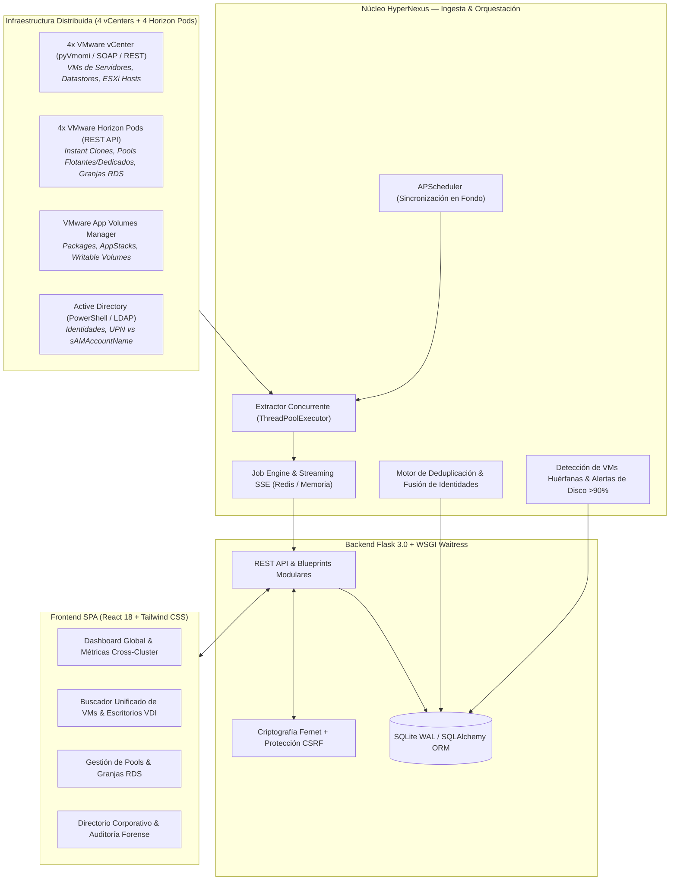

# ⚡ HyperNexus — Unified Multi-Hypervisor & Workspace Orchestrator for VMs & VDIs

[](https://www.python.org/downloads/)
[](https://flask.palletsprojects.com/)
[](https://react.dev/)
[](https://tailwindcss.com/)
[](https://docs.pylonsproject.org/projects/waitress/)
[](https://opensource.org/licenses/MIT)
[](#-suite-de-pruebas-automatizadas)
[](#-modo-demostración-zero-config)

> ### 📌 Resumen de 1 Línea (TL;DR)
> **HyperNexus es un plano único de control (*Single-Pane-of-Glass*) y motor de observabilidad que unifica 4 vCenters, 4 pods de VMware Horizon, App Volumes y Active Directory en un buscador global instantáneo con telemetría de capacidad, detección de huérfanos y deduplicación de identidades.**

---



> [!TIP]
> **Listo para probar en segundos:** HyperNexus incluye un **Modo Demo Zero-Config** (`DEMO_MODE=1`) con una base de datos SQLite pre-sembrada que emula los 4 vCenters y 4 Horizon Connection Servers con más de 70 máquinas virtuales y escritorios VDI, 31 usuarios corporativos, 7 Desktop Pools, granjas RDS, paquetes de App Volumes y alertas de almacenamiento crítico. **No requiere conexión a hipervisores reales para su evaluación.**

---

## 🎯 ¿Qué problema resuelve HyperNexus?

En infraestructuras corporativas medianas y grandes, los entornos de virtualización crecen de manera fragmentada debido a la segregación por zonas de red (DMZ vs. Red Interna), datacenters geográficos o unidades de negocio independientes:

* **4 instancias independientes de VMware vCenter** gestionando clusters de virtualización y máquinas virtuales de infraestructura/servidores.
* **4 pods independientes de VMware Horizon Connection Server** gestionando escritorios virtuales (VDI) y aplicaciones remotas (RDS).
* Instancias satélite de **VMware App Volumes Manager** y servidores de **Active Directory**.

### La Consecuencia: Fatiga de Consolas (*Console Fatigue*) y Puntos Ciegos
1. **Pérdida crítica de tiempo (Console Hopping):** Para responder una pregunta simple como *"¿dónde está la máquina del usuario X?"* o *"¿en qué pod se desplegó el servidor Y?"*, los administradores debían autenticarse y abrir **más de 10 consolas web separadas**, revisando manualmente cada una.
2. **Inexistencia de un buscador global:** Las herramientas nativas de VMware no ofrecen búsqueda cruzada federada (*cross-cluster / cross-pod*).
3. **Escritorios y discos huérfanos (*Orphaned VMs*):** Escritorios VDI dados de baja o pools eliminados de Horizon continuaban ocupando gigabytes de almacenamiento de alta velocidad en la SAN/vSAN de vSphere sin que nadie lo detectara.
4. **Ceguera de almacenamiento crítico:** Servidores y VDIs superando el 85% y 90% de capacidad de disco sin un tablero unificado que alerte antes del congelamiento del sistema operativo.
5. **Divergencia de identidades:** Nombres de usuario bajo UPN moderno en un pod y bajo formato `sAMAccountName` (pre-Windows 2000) en otro, generando cuentas duplicadas e inconsistencias en la entrega de licencias de software.

**HyperNexus resuelve esto actuando como un nexo centralizador**: ingesta todas las fuentes en paralelo y provee un **buscador global instantáneo, reconciliación automática de identidades y diagnóstico de salud en un único plano de control**.

---

## 🛠️ ¿Para qué sirve? (Casos de Uso Clave)

| Caso de Uso | ¿Qué hace HyperNexus? | Beneficio Operativo |
| :--- | :--- | :--- |
| **Búsqueda Global Cross-Cluster** | Localiza por nombre, IP, usuario asignado o pool a través de los 4 vCenters y 4 Horizons en milisegundos. | Reduce el tiempo de atención de soporte Nivel 2/3 de 15 minutos a 5 segundos. |
| **Auditoría Forense de Huérfanos** | Correlaciona el catálogo de Horizon contra las VMs reales en disco en vCenter para detectar máquinas sin pool o sin usuario activo. | Recupera cientos de gigabytes de almacenamiento SAN/vSAN al eliminar discos abandonados. |
| **Detección Temprana de Almacenamiento Crítico** | Escanea el aprovisionamiento de discos de todas las VMs y clasifica aquellas con consumo >85% y >90%. | Previene caídas imprevistas de servicios críticos o corrupción de perfiles de usuario. |
| **Deduplicación & Fusión de Identidades AD** | Detecta colisiones heurísticas entre cuentas corporativas y las valida contra Active Directory, permitiendo su fusión canónica en 1 clic. | Garantiza una única fuente de la verdad para asignación de hardware y software corporativo. |
| **Control de Writable Volumes & AppStacks** | Audita discos de persistencia de usuario y paquetes de software huérfanos que ya no corresponden a ningún colaborador. | Evita desperdicio de licencias y optimiza la capacidad del repositorio de App Volumes. |
| **Trazabilidad & Cumplimiento (Compliance)** | Registra cada consulta, cambio de credencial, fusión de usuarios y extracción en una bitácora inmutable con IP y usuario. | Facilita responder a requerimientos de auditorías internas y normativas de seguridad (ISO 27001, SOC 2). |

---

## 🖥️ ¿Cómo se usa? (Guía de Flujo Operativo)

### 1. Acceso al Sistema
1. Ingresa a `http://localhost:5000` en tu navegador.
2. Inicia sesión con cualquiera de los perfiles demo provistos:
   - **Administrador:** `admin` / `Admin123!`
   - **Operador:** `demo` / `Demo123!`
   - **Auditor:** `auditor` / `Auditor123!`

### 2. Dashboard Global & Widgets en Tiempo Real
* Visualiza las tarjetas de **KPIs consolidados**: Total de VMs y VDIs activas, sesiones concurrentes, almacenamiento aprovisionado global y estado de salud de agentes VMware.
* Revisa el widget de **Discos Críticos (>90%)** y el detector de **Máquinas Huérfanas**.
* Personaliza los paneles mediante el botón **Widgets** y ajusta el intervalo de actualización automática (1m, 5m, 15m, 30m, 1h).

### 3. Buscador Global Instantáneo (Barra Superior)
* Escribe cualquier término en la barra de búsqueda superior (ejemplo: `jdoe`, `win10`, `pool-finanzas`, `10.10.`).
* El sistema filtra en vivo sobre todas las máquinas, pools, granjas RDS y usuarios de los 4 vCenters y 4 Horizon Connection Servers simultáneamente.

### 4. Extracción de Información en Vivo
* Dirígete a la pestaña **Extracción de Información** o presiona **Extraer Datos**.
* El motor lanza un hilo concurrente (`ThreadPoolExecutor`) contra cada hipervisor configurado.
* Puedes observar el progreso en tiempo real mediante la **consola de eventos en streaming (SSE)** con barra de porcentaje y bitácora detallada.

### 5. Directorio de Usuarios & Fusión de Duplicados
* Accede a la pestaña **Directorio Usuarios**.
* Haz clic en **Buscar Duplicados**: el motor analizará colisiones por nombre y email y las contrastará contra Active Directory.
* En la lista de candidatos, selecciona **Fusionar con Canónico**: el sistema reasigna de manera atómica todas las máquinas virtuales y paquetes de software al registro principal y purga la cuenta redundante, registrando la auditoría del cambio.

### 6. Exportación de Reportes
* Dirígete a la pestaña **Reportes & Excel**.
* Selecciona los filtros deseados (por vCenter, estado de máquina, pool o rango de almacenamiento) y exporta informes ejecutivos en formato **Excel (.xlsx)** o **CSV**, protegidos contra Path Traversal.

---

## ⚙️ ¿Cómo configurarlo? (Paso a Paso)

### 1. Variables de Entorno (`.env`)

Copia la plantilla `.env.example` a `.env`:
```bash
cp .env.example .env
```

| Variable | Tipo | Descripción | Valor por Defecto |
| :--- | :--- | :--- | :--- |
| **`DEMO_MODE`** | `1` o `0` | **`1`** activa el modo demo offline con datos simulados. **`0`** activa la conexión real con hipervisores y AD. | `1` |
| **`SECRET_KEY`** | String | Clave criptográfica para firmas seguras de sesión Flask. | *(Generada automáticamente)* |
| **`FERNET_KEY`** | Base64 | Clave simétrica Fernet para cifrar las contraseñas de los hipervisores en base de datos. | *(Generada automáticamente)* |
| **`AD_DOMAIN`** | String | FQDN del dominio corporativo de Active Directory (ej. `corp.local` o `empresa.com`). | `corp.local` |
| **`INVENTARIO_DB_PATH`** | Ruta | Ubicación absoluta o relativa del archivo de base de datos SQLite. | `data/inventario.db` |
| **`REDIS_URL`** | URL | URL de Redis para el motor de streaming y cola de jobs (opcional; si está vacío, opera en memoria). | `redis://localhost:6379/0` |
| **`PORT`** | Entero | Puerto TCP en el que escuchará el servidor web. | `5000` |
| **`FORCE_HTTPS`** | `1` o `0` | Forza cookies de sesión seguras (`Secure=True`) en despliegues con terminación TLS. | `0` |

---

### 2. Conectar Hipervisores Reales (Producción: `DEMO_MODE=0`)

Para pasar de la demo a producción con tus clusters reales:

1. Configura `DEMO_MODE=0` en tu archivo `.env`.
2. Inicia la aplicación y navega a **Servidores & VCs** (`/servidores`) con rol Administrador.
3. Haz clic en **Nuevo Servidor** y registra cada una de tus instancias:
   * **Instancias de vCenter:** Tipo `vCenter`, URL base (ej. `https://vcenter-dc1.tuempresa.local`), usuario de servicio (con permisos de solo lectura o superiores) y contraseña.
   * **Instancias de Horizon:** Tipo `Horizon`, URL del Connection Server (ej. `https://horizon-pod1.tuempresa.local`), dominio corporativo y credenciales de API.
   * **App Volumes Manager:** Tipo `App Volumes`, URL del administrador (ej. `https://appvol.tuempresa.local`).
4. *Todas las credenciales ingresadas se cifran automáticamente en reposo mediante **Fernet (AES-128-CBC + HMAC-SHA256)** antes de guardarse en la base de datos.*
5. Haz clic en **Test Conexión** para validar la comunicación de red y los certificados TLS.

---

### 3. Configurar Active Directory (PowerShell / LDAP)

* En sistemas **Windows**: HyperNexus utiliza PowerShell con comandos parametrizados (`Get-ADUser`) contra el dominio especificado en `AD_DOMAIN`. Requiere que el servidor tenga conectividad de red LDAP/LDAPS (puertos 389/636) hacia los controladores de dominio.
* En sistemas **Linux / Docker**: Se configuran variables estándar de consulta LDAP o se utiliza el modo de sincronización vía API del directorio.

---

## ⚡ Guías de Arranque Rápido

### Opción A: Lanzador en Windows con 1 Clic (.bat)
```bat
:: Arranca el servidor Waitress de producción y abre el navegador automáticamente
iniciar_prod.bat

:: O arranca en modo desarrollo con autorecarga de código
iniciar_dev.bat
```

### Opción B: Despliegue con Docker Compose
```bash
# Construye la imagen multi-etapa y levanta HyperNexus + Redis
docker compose up -d

# Acceder en: http://localhost:5000
```

### Opción C: Instalación Manual con Python
```bash
# 1. Crear entorno virtual
python -m venv .venv
.venv\Scripts\activate   # En Linux: source .venv/bin/activate

# 2. Instalar dependencias
pip install -r requirements.txt

# 3. Configurar entorno
cp .env.example .env

# 4. Iniciar servidor de producción Waitress
python server_prod.py
```

---

## 📁 Estructura del Repositorio

```text
HyperNexus/
├── core/                               # Núcleo de integración y clientes de infraestructura
│   ├── ad_client.py                    # Cliente parametrizado de Active Directory (PowerShell/LDAP)
│   ├── appvolumes_client.py            # Cliente REST para VMware App Volumes Manager
│   ├── horizon_client.py               # Cliente REST para VMware Horizon Connection Server
│   ├── vcenter_client.py               # Cliente REST vSphere Automation API
│   ├── vcenter_soap.py                 # Cliente SOAP pyVmomi para vCenter
│   └── credenciales.py                 # Gestor de cifrado y descifrado seguro (Fernet)
│
├── web/                                # Aplicación Web (Flask 3.0 + React SPA)
│   ├── routes/                         # Blueprints y controladores REST
│   │   ├── api.py                      # Endpoints centrales del inventario, VMs y métricas
│   │   ├── auth_routes.py              # Autenticación, bloqueo por fuerza bruta y sesiones
│   │   ├── directorio.py               # Gestión del directorio corporativo y sincronización AD
│   │   ├── inventario.py               # Ingesta batch y orquestación multi-hipervisor
│   │   ├── reportes.py                 # Exportación de reportes Excel / CSV seguros
│   │   └── usuarios.py                 # Administración de operadores del sistema
│   ├── frontend/                       # Código fuente de la Single Page Application (React 18)
│   │   ├── src/pages/                  # Vistas: Dashboard, Máquinas, Directorio, Granjas, etc.
│   │   ├── src/components/             # Componentes UI (KPI cards, tablas, modales, alertas)
│   │   └── dist/                       # Bundle compilado de producción servido por Flask
│   ├── db.py                           # Modelos SQLAlchemy (Máquinas, Pools, Usuarios, Auditoría)
│   ├── extensions.py                   # Inicialización de extensiones (CSRFProtect, Limiter)
│   ├── jobs.py                         # Cola de tareas concurrentes y Server-Sent Events (SSE)
│   ├── scheduler.py                    # Planificador automático en segundo plano (APScheduler)
│   ├── appvolumes_utils.py             # Utilidades de diagnóstico de asignaciones huérfanas
│   └── directorio_dedup_utils.py       # Motor de deduplicación y fusión de usuarios
│
├── data/                               # Almacenamiento local de base de datos
│   └── inventario.db                   # Base SQLite pre-sembrada con dataset demo
│
├── tests/                              # Suite de pruebas automatizadas (Pytest)
│   ├── conftest.py                     # Fixtures, base de datos temporal en memoria y mocks
│   ├── test_auth.py                    # Pruebas de autenticación y sesiones
│   ├── test_directorio_dedup.py        # Pruebas de detección y fusión de usuarios duplicados
│   ├── test_security_findings.py       # Pruebas de regresión de seguridad (CSRF, RCE, Traversal)
│   ├── test_extraccion_batch.py        # Pruebas de ingesta concurrente multi-hilo
│   └── test_granja_api.py              # Pruebas de granjas RDS y aplicaciones publicadas
│
├── seed_db.py                          # Seeder generador de datos realistas para demostración
├── server_prod.py                      # Servidor WSGI Waitress de alto rendimiento
├── Dockerfile                          # Build multi-etapa optimizado (Node 20 + Python 3.12-slim)
├── docker-compose.yml                  # Orquestación con servicio Redis y volúmenes persistentes
├── iniciar_prod.bat                    # Script de arranque Windows con 1 clic
└── LICENSE                             # Licencia de código abierto MIT
```

---

## 🧪 Suite de Pruebas Automatizadas

El proyecto cuenta con una cobertura integral de pruebas que validan lógica de negocio, concurrencia, mitigación de vulnerabilidades y endpoints HTTP:

```bash
# Ejecutar todas las pruebas con pytest
pytest tests/ -v
```

```text
============================= test session starts =============================
collected 74 items

tests/test_auth.py ............                                          [ 16%]
tests/test_credenciales.py .....                                         [ 22%]
tests/test_directorio_dedup.py .....                                     [ 29%]
tests/test_extraccion_batch.py ....                                      [ 35%]
tests/test_granja_api.py ...                                             [ 39%]
tests/test_granja_extraccion.py .....                                    [ 45%]
tests/test_granja_models.py .                                            [ 47%]
tests/test_granja_utils.py ...                                           [ 51%]
tests/test_inventario_batch.py .....                                     [ 58%]
tests/test_jobs.py .........                                             [ 70%]
tests/test_kpi_utils.py ..                                               [ 72%]
tests/test_password_hash.py ...                                          [ 77%]
tests/test_redesign.py ....                                              [ 82%]
tests/test_security_findings.py .........                                [ 94%]
tests/test_vcenter_models.py ....                                        [100%]

====================== 74 passed in 24.63s ======================
```

---

## 📄 Licencia

Este proyecto está distribuido bajo la licencia **MIT**. Consulte el archivo [LICENSE](LICENSE) para más detalles.

Desarrollado y profesionalizado por **José D. Martone** (2026).
