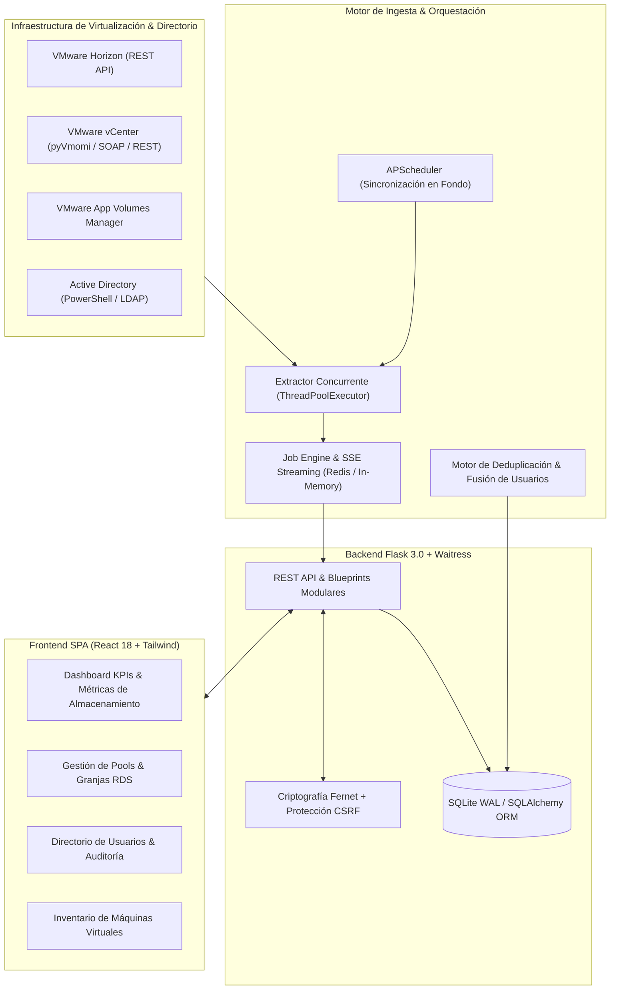

# 🖥️ Inventario VDI — Enterprise Virtual Desktop & Infrastructure Orchestrator

[](https://www.python.org/downloads/)
[](https://flask.palletsprojects.com/)
[](https://react.dev/)
[](https://tailwindcss.com/)
[](https://docs.pylonsproject.org/projects/waitress/)
[](https://opensource.org/licenses/MIT)
[](#-suite-de-pruebas-automatizadas)
[](#-modo-demostración-zero-config)

**Inventario VDI** es una plataforma web integral de observabilidad, auditoría y orquestación diseñada para entornos corporativos de virtualización de escritorios (**VDI - Virtual Desktop Infrastructure**) a gran escala.

Permite centralizar, monitorear y gobernar flotas heterogéneas distribuidas en múltiples instancias de **VMware Horizon Connection Servers**, hipervisores **VMware vCenter / vSphere**, gestores de paquetería **VMware App Volumes** y **Microsoft Active Directory (AD)**.



> [!TIP]
> **Listo para probar en segundos:** Inventario VDI incluye un **Modo Demo Zero-Config** (`DEMO_MODE=1`) con una base de datos SQLite pre-sembrada que contiene más de 70 máquinas virtuales, 31 usuarios de Active Directory, 7 Desktop Pools, granjas RDS, paquetes de App Volumes y alertas de almacenamiento crítico. **No requiere conexión a un hipervisor real para su evaluación.**

---

## 🎯 ¿Qué problemática resuelve Inventario VDI?

En infraestructuras de virtualización empresarial con cientos o miles de escritorios virtuales, la administración diaria presenta desafíos críticos:

1. **Fragmentación de consolas:** Los administradores deben saltar entre Horizon Administrator Console, vSphere Client, App Volumes Manager y consolas de Active Directory para rastrear un único puesto de trabajo.
2. **Capacidad y costos ocultos:** Escritorios huérfanos (*orphaned VMs*), snapshots olvidados de Golden Masters y discos que superan el 90% de capacidad sin alertas tempranas degradan la infraestructura de almacenamiento (SAN/vSAN).
3. **Inconsistencia de identidades corporativas:** Diferencias entre el UPN moderno y el `sAMAccountName` (pre-Windows 2000), o cuentas duplicadas generadas tras cambios de razón social o fusiones empresariales.
4. **Asignaciones residuales de App Volumes:** Paquetes de software y *Writable Volumes* asignados a usuarios dados de baja o máquinas desmanteladas que consumen licencias y espacio de almacenamiento.
5. **Falta de auditoría unificada:** Dificultad para responder con celeridad ante auditorías de seguridad sobre quién accedió a qué escritorio, desde qué IP y en qué rango horario.

**Inventario VDI unifica este ecosistema** en una interfaz moderna, reactiva y veloz con capacidades avanzadas de deduplicación y diagnóstico.

---

## ✨ Características Principales

### 🖥️ Ingesta Multi-Hipervisor Concurrente
- **VMware Horizon**: Conexión con Connection Servers vía REST API. Ingesta de Pools (Instant Clones, Linked Clones, Dedicados, Flotantes), Granjas RDS (Remote Desktop Services), aplicaciones publicadas y sesiones en vivo.
- **VMware vCenter / vSphere**: Ingesta profunda mediante pyVmomi (SOAP) y REST. Telemetría de VMs, datastores, clusters ESXi, utilización de vCPU, memoria RAM y almacenamiento aprovisionado vs. usado.
- **VMware App Volumes**: Detección de aplicaciones, paquetes, asignaciones de usuario y estado de Writable Volumes (discos de persistencia de usuario).

### 👥 Directorio & Motor de Deduplicación Inteligente
- **Directorio Unificado**: Catálogo central de usuarios con vinculación muchos a muchos (M:M) hacia escritorios virtuales y aplicaciones.
- **Detección Automática de Duplicados**: Algoritmo de similitud que detecta colisiones de cuentas por nombre o email, y las valida estrictamente contra Active Directory.
- **Fusión Canónica en 1 Clic**: Reasigna de forma atómica todas las máquinas y paquetes a la cuenta canónica, preservando el historial de auditoría y eliminando la duplicada sin riesgo de inconsistencias.

### 🚨 Diagnóstico de Salud & Almacenamiento
- **Detección de VMs Huérfanas**: Identificación automática de VMs clonadas cuyos usuarios fueron desvinculados o pools que fueron eliminados de Horizon pero persisten en disco.
- **Alertas de Capacidad Crítica**: Alertas visuales y clasificación para discos con más del 85% y 90% de utilización.
- **Tracking de Bots RPA**: Identificación y etiquetado de estaciones virtuales dedicadas a automatización de procesos (Robotic Process Automation).

### 🔒 Seguridad de Grado Corporativo
- **Cifrado de Credenciales**: Almacenamiento seguro de contraseñas de hipervisores y tokens mediante cifrado simétrico **Fernet (AES-128-CBC + HMAC-SHA256)**.
- **Políticas de Autenticación**: Hashing de contraseñas con **PBKDF2-HMAC-SHA256 / Argon2**, bloqueo temporal ante intentos fallidos reiterados (*lockout*) y sesiones seguras HTTP-only.
- **Protección CSRF Integral**: Cobertura estricta con tokens `X-CSRFToken` en todas las operaciones mutables de la API REST.
- **Mitigación de Inyección de Comandos**: Scripts dinámicos parametrizados de PowerShell con desacoplamiento total en archivos JSON de entrada.
- **Protección Path Traversal**: Descarga controlada de reportes y plantillas mediante `send_from_directory` con rutas normalizadas.

---

## 🚀 Modo Demostración Zero-Config

Para evaluar la aplicación en un portfolio o entorno local sin acceso a servidores vCenter ni Horizon:

1. El repositorio incluye una base de datos pre-configurada en `data/inventario.db`.
2. La variable `DEMO_MODE=1` viene activada por defecto en `.env`.
3. Todos los nombres de empresas, servidores, IPs y credenciales en el entorno de demostración son estrictamente genéricos (`Acme Corp`, `GlobalTech`, `corp.local`, `10.10.x.x`).

### 🔑 Credenciales de Acceso Demo

| Usuario | Contraseña | Rol | Acceso |
| :--- | :--- | :--- | :--- |
| **`admin`** | `Admin123!` | Administrador | Control total de servidores, ingesta, usuarios y configuración |
| **`demo`** | `Demo123!` | Usuario | Acceso a métricas, inventario de VMs y catálogo de aplicaciones |
| **`auditor`** | `Auditor123!` | Auditor | Consulta de logs de auditoría, eventos de tareas y reportes |

---

## ⚡ Guía de Inicio Rápido

### Opción 1: Lanzadores Rápidos en Windows (.bat)

El método más sencillo en sistemas Windows. El script detecta el intérprete Python, verifica el entorno virtual e inicia el servidor de producción abriendo el navegador automáticamente:

```bat
:: Iniciar en modo Producción (Waitress en http://127.0.0.1:5000)
iniciar_prod.bat

:: O iniciar en modo Desarrollo con recarga automática
iniciar_dev.bat
```

---

### Opción 2: Docker & Docker Compose (Multiplataforma)

Ejecuta la solución completa (Backend Python + Servidor WSGI + Assets React optimizados + Redis) en contenedores aislados:

```bash
# 1. Clonar el repositorio
git clone https://github.com/tu-usuario/inventario-vdi.git
cd inventario-vdi

# 2. Levantar los contenedores
docker compose up -d

# 3. Acceder en el navegador
# http://localhost:5000
```

---

### Opción 3: Instalación Manual

```bash
# 1. Crear y activar entorno virtual
python -m venv .venv
# En Windows:
.venv\Scripts\activate
# En Linux / macOS:
source .venv/bin/activate

# 2. Instalar dependencias
pip install -r requirements.txt

# 3. Configurar variables de entorno
cp .env.example .env

# 4. (Opcional) Regenerar base de datos demo
python seed_db.py

# 5. Iniciar con servidor Waitress de producción
python server_prod.py
```

---

## 📁 Estructura del Repositorio

```text
InventarioVDI/
├── core/                               # Núcleo de integración y clientes de infraestructura
│   ├── ad_client.py                    # Cliente parametrizado de Active Directory (PowerShell/LDAP)
│   ├── appvolumes_client.py            # Cliente REST para VMware App Volumes Manager
│   ├── horizon_client.py               # Cliente REST para VMware Horizon Connection Server
│   ├── vcenter_client.py               # Cliente REST vSphere Automation API
│   ├── vcenter_soap.py                 # Cliente SOAP pyVmomi para vCenter
│   └── credenciales.py                 # Gestor de cifrado y descifrado seguro (Fernet)
│
├── web/                                # Aplicación Web (Flask 3.0 + React SPA)
│   ├── routes/                         # Blueprints y controladores REST
│   │   ├── api.py                      # Endpoints centrales del inventario, VMs y métricas
│   │   ├── auth_routes.py              # Autenticación, bloqueo por fuerza bruta y sesiones
│   │   ├── directorio.py               # Gestión del directorio corporativo y sincronización AD
│   │   ├── inventario.py               # Ingesta batch y orquestación de hypervisores
│   │   ├── reportes.py                 # Exportación de reportes Excel / CSV seguros
│   │   └── usuarios.py                 # Administración de operadores del sistema
│   ├── frontend/                       # Código fuente de la Single Page Application (React 18)
│   │   ├── src/pages/                  # Vistas: Dashboard, Máquinas, Directorio, Granjas, etc.
│   │   ├── src/components/             # Componentes UI (KPI cards, tablas, modales, alertas)
│   │   └── dist/                       # Bundle compilado de producción servido por Flask
│   ├── db.py                           # Modelos SQLAlchemy (Máquinas, Pools, Usuarios, Auditoría)
│   ├── extensions.py                   # Inicialización de extensiones (CSRFProtect, Limiter)
│   ├── jobs.py                         # Cola de tareas concurrentes y Server-Sent Events (SSE)
│   ├── scheduler.py                    # Planificador automático en segundo plano (APScheduler)
│   ├── appvolumes_utils.py             # Utilidades de diagnóstico de asignaciones huérfanas
│   └── directorio_dedup_utils.py       # Motor de deduplicación y fusión de usuarios
│
├── data/                               # Almacenamiento local de base de datos
│   └── inventario.db                   # Base SQLite pre-sembrada con dataset demo
│
├── tests/                              # Suite de pruebas automatizadas (Pytest)
│   ├── conftest.py                     # Fixtures, base de datos temporal en memoria y mocks
│   ├── test_auth.py                    # Pruebas de autenticación y sesiones
│   ├── test_directorio_dedup.py        # Pruebas de detección y fusión de usuarios duplicados
│   ├── test_security_findings.py       # Pruebas de regresión de seguridad (CSRF, RCE, Traversal)
│   ├── test_extraccion_batch.py        # Pruebas de ingesta concurrente multi-hilo
│   └── test_granja_api.py              # Pruebas de granjas RDS y aplicaciones publicadas
│
├── seed_db.py                          # Seeder generador de datos realistas para demostración
├── server_prod.py                      # Servidor WSGI Waitress de alto rendimiento
├── Dockerfile                          # Build multi-etapa optimizado (Node 20 + Python 3.12-slim)
├── docker-compose.yml                  # Orquestación con servicio Redis y volúmenes persistentes
├── iniciar_prod.bat                    # Script de arranque Windows con 1 clic
└── LICENSE                             # Licencia de código abierto MIT
```

---

## 🧪 Suite de Pruebas Automatizadas

El proyecto cuenta con una cobertura integral de pruebas que validan lógica de negocio, concurrencia, mitigación de vulnerabilidades y endpoints HTTP:

```bash
# Ejecutar todas las pruebas con pytest
pytest tests/ -v
```

```text
============================= test session starts =============================
collected 74 items

tests/test_auth.py ............                                          [ 16%]
tests/test_credenciales.py .....                                         [ 22%]
tests/test_directorio_dedup.py .....                                     [ 29%]
tests/test_extraccion_batch.py ....                                      [ 35%]
tests/test_granja_api.py ...                                             [ 39%]
tests/test_granja_extraccion.py .....                                    [ 45%]
tests/test_granja_models.py .                                            [ 47%]
tests/test_granja_utils.py ...                                           [ 51%]
tests/test_inventario_batch.py .....                                     [ 58%]
tests/test_jobs.py .........                                             [ 70%]
tests/test_kpi_utils.py ..                                               [ 72%]
tests/test_password_hash.py ...                                          [ 77%]
tests/test_redesign.py ....                                              [ 82%]
tests/test_security_findings.py .........                                [ 94%]
tests/test_vcenter_models.py ....                                        [100%]

====================== 74 passed in 24.63s ======================
```

---

## ⚙️ Variables de Entorno Principales

El archivo `.env` permite configurar el comportamiento de la plataforma:

| Variable | Descripción | Valor por Defecto |
| :--- | :--- | :--- |
| `DEMO_MODE` | Activa el modo demostración sin requerir hipervisores reales | `1` |
| `SECRET_KEY` | Clave criptográfica para firmas de sesión Flask | Generada automáticamente |
| `FERNET_KEY` | Clave para cifrado simétrico de credenciales almacenadas | Generada automáticamente |
| `AD_DOMAIN` | Dominio corporativo de Active Directory | `corp.local` |
| `REDIS_URL` | Conexión con Redis para streaming de jobs (opcional) | `redis://localhost:6379/0` |
| `FORCE_HTTPS` | Fuerza cookies seguras para despliegues con SSL/TLS | `0` |
| `PORT` | Puerto de escucha del servidor web | `5000` |

---

## 📄 Licencia

Este proyecto está distribuido bajo la licencia **MIT**. Consulte el archivo [LICENSE](LICENSE) para más detalles.

Desarrollado y profesionalizado por **José D. Martone** (2026).
